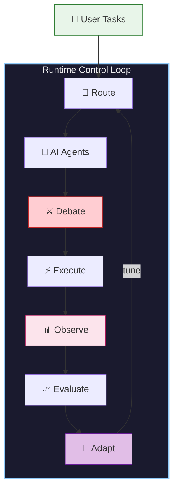
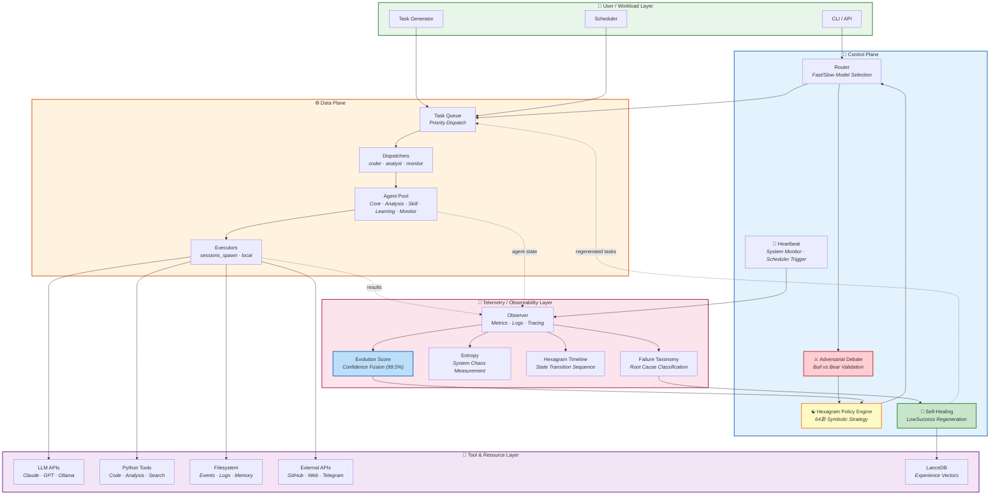
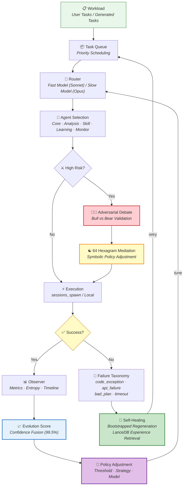

# AIOS — AI Agent Operating System

> **AIOS is a runtime control system for autonomous AI agents.**
>
> It turns AI agents into **observable**, **self-healing**, **evolving** systems.
>
> AIOS follows an autonomic control loop similar to [MAPE-K](https://en.wikipedia.org/wiki/Autonomic_computing) — Monitor, Analyze, Plan, Execute, Knowledge.

---

## Overview: What AIOS Does (5 seconds)



> **Route → Debate → Execute → Observe → Evaluate → Adapt → repeat.**
>
> That's it. AIOS is a closed control loop that makes AI agents reliable.

---

## 图1: Runtime Control Architecture（四层 + 遥测层）



---

## 图2: AIOS Runtime Control Loop（闭环控制 — MAPE-K）



---

## 核心创新点

### 1. ⚔️ Adversarial Validation（对抗验证）
Bull vs Bear 辩论机制，高风险任务自动触发双方论证，64卦调解融合最终方案。在 agent runtime 中极为少见。

### 2. ☯️ Hexagram Policy Engine（卦象策略引擎）
```
metrics → trigram → hexagram → strategy
```
基于64卦的符号化策略引擎，将系统状态映射为卦象，自动匹配对应策略。不是玄学，是 **symbolic policy representation**。

### 3. 🔁 Self-Healing via Bootstrapped Regeneration（自愈重生）
灵感来自 sirius (NeurIPS 2025)：
```
failure → feedback → regenerate → retry → experience library
```
失败轨迹不丢弃，通过 LanceDB 向量检索历史成功策略，自动重生。

### 4. 📡 Closed-Loop Telemetry（闭环遥测）
完整的可观测性层：
- **Metrics** — 成功率、延迟、资源使用
- **Entropy** — 系统混乱度测量
- **Timeline** — 卦象状态转换序列
- **Failure Taxonomy** — 根因分类（code_exception / api_failure / bad_plan / timeout）
- **Evolution Score** — 置信度融合（当前 99.5%）

---

## 类比

| Kubernetes | AIOS |
|------------|------|
| API Server | Router |
| Scheduler | Dispatcher |
| Controller | Observer |
| Pod | Agent |
| etcd | Task Queue |
| Admission Controllers | 64 Hexagram Policy |
| HPA + Self-Healing | LowSuccess Regeneration |
| Prometheus + Grafana | Telemetry / Observability Layer |

---

## 系统指标（当前）

- **Agent Pool**: 45+ agents (Core · Analysis · Skill · Learning · Monitor)
- **Evolution Score**: 99.5/100
- **Task Success Rate**: 80.4% → 85%+ (target)
- **Confidence Fusion**: base × 0.65 + evolution × 0.35 + bonuses
- **Self-Healing Rate**: 75% auto-regeneration
- **Hexagram**: 坤卦 (stability phase)

---

*Generated: 2026-03-05 | AIOS v3.4*
